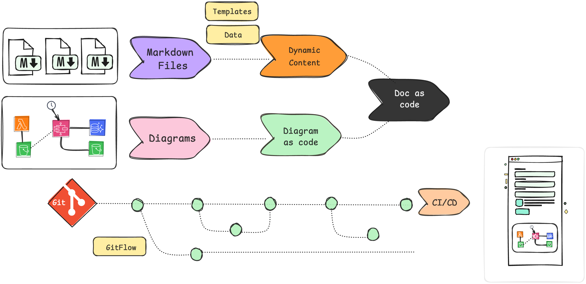
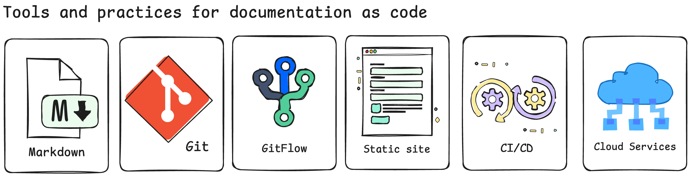
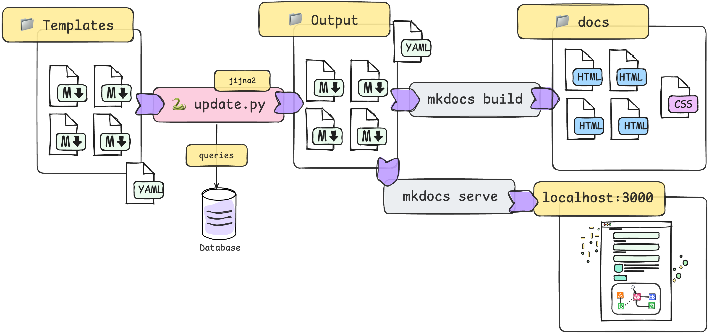

---

# ⚙️ Doc as Code Tutorial

## 🚀 MkDocs & MkDocs-material  
**MkDocs** is an excellent solution for implementing a documentation portal that can be `easily updated with code`, helping to keep your software development project documentation up-to-date and versioned. 

In this repository, I have created a simple site to document the data model and machine learning project. 

The documentation will include `charts`, `tables`, and `architecture` examples, providing a comprehensive and `easy-to-understand` guide on how to implement this framework in combination with two other **🐍Python** libraries.

## What is Documentation as Code?  
Documentation and its updates are an important process in many companies that develop software, where this process is carried out using different tools, many of which are paid solutions.  
Therefore, in recent times, the concept of **"doc as code"** has emerged. This means using the same tools and workflow used in software development to `manage`, `version`, and `deploy` documentation.  
This approach not only allows for better tracking of the documentation but also facilitates its maintenance and ensures alignment with the same best practices used in software development, not just in the code but also in the documentation.

---

# Practices and Benefits of Documentation as Code

## Tools and Practices for Documentation as Code

For the development of these sites, it is essential to understand some practices and tools that allow us to implement this approach. Below is a detailed list of the most important aspects to cover in this tutorial.

- 📝 **Markdown**: It is the most common markup language for writing documentation due to its simplicity and ability to integrate with version control platforms and static site generators.
- 🗂️ **Git**: Git allows versioning documentation just like code. Thanks to Git, each change in the documentation is recorded, enabling teams to track edits, revert changes, and collaborate more efficiently.
- 🔄 **Gitflow**: This methodology provides a structured workflow to manage versions and revisions of documentation, ensuring that any change is approved and tested before reaching production. Gitflow also facilitates collaboration between teams, allowing for safe and organized change management.
- ☁️ **Cloud Services**: By using services like AWS S3, Netlify, or GitHub Pages, you can deploy documentation at a low cost. These services allow you to create static sites, which are fast, secure, and easily accessible to users.
- 🌐 **Static Site Generators**: Tools like Docusaurus, Jekyll, or Hugo take documentation written in Markdown and convert it into a navigable website. This allows you to create rich and organized documentation without the need for a server.
- 🚀 **Continuous Integration (CI/CD)**: Using CI/CD pipelines (such as GitHub Actions, GitLab CI, or Jenkins) allows you to automatically deploy changes to the documentation when a new version is merged or modifications are approved. This ensures that the documentation is always up-to-date and available.

---

# MkDocs Overview  
In this section, we explain the **MkDocs** static site generator and its role in our documentation site.

**MkDocs** is a static site generator written in **🐍Python**, specifically designed for documenting projects. Its goal is to simplify the creation of documentation using Markdown files, which are easy to write and read.  
With minimal configuration, **MkDocs** converts Markdown files into a navigable and well-structured documentation website, making it ideal for developers and teams who want to keep their documentation up to date.

---

## MkDocs Material  
**MkDocs Material** is an advanced theme for **MkDocs** that follows Google’s Material Design guidelines.  
Some of the key features it offers include:  
* 📱 **Responsive Design**: Automatically adapts to any screen size.  
* 🎨 **Customization**: Easily modify colors, fonts, favicon, and logo to match your project’s visual identity.  
* 🔍 **Search Interface**: Advanced search groups results and highlights searched terms, helping users quickly find the information they need.  
* ⚡ **Lazy Loading**: Implements lazy loading for search results, improving performance and reducing load times.  
* 🔗 **Integrations**: Compatible with Google Analytics, Disqus, and GitHub, facilitating traffic analysis, user feedback, and direct connection to the project repository.

---

## Mermaid  
Mermaid is a **JavaScript** library for creating diagrams and charts from text. By integrating with MkDocs Material, Mermaid allows you to generate visualizations such as flowcharts, entity-relationship diagrams, and other charts within the documentation without the need for external tools.

---

## 🧩 Dynamic Page: Jinja2  
**Jinja2** is a library that allows embedding variables and data from Python dictionaries into HTML, making web pages dynamic. This library is commonly used for generating dynamic HTML and sending personalized emails.

---

# 📝 Tutorial: Building a Documentation Site for a Machine Learning Pipeline  

Now that we have covered the theory behind **Documentation as Code** and some key practices and tools, let's move on to the hands-on part of this tutorial. In this section, we will guide you through creating a documentation site for a small machine learning pipeline solution, using health data from a medical entity.

### Pages of the Site  
Our site will have the following pages:

* 📄 `index.md`: Home page  
* 📄 `tables.md`: Explanation of Synthea data tables  
* 📄 `architecture.md`: Data processing architecture in AWS  
* 📄 `glossary.md`: Glossary of terms  

### Handling Dynamic Content with Jinja2  
In this tutorial, I will leverage **Jinja2** to handle dynamic content in our documentation. Specifically:

* For the **introduction** page, I will display the date of the last update of the documentation, which will be pulled from a database table.
* For the **tables** page, I will showcase the first few results of a dataframe query to demonstrate how a data table appears, using **Jinja2** for dynamic rendering.
* The **architecture** page explains the architecture supporting this functionality, and further details can be found in another repository called [diagram-as-code](https://github.com/r0mymendez/diagram-as-code), which provides the blueprint for implementation.

