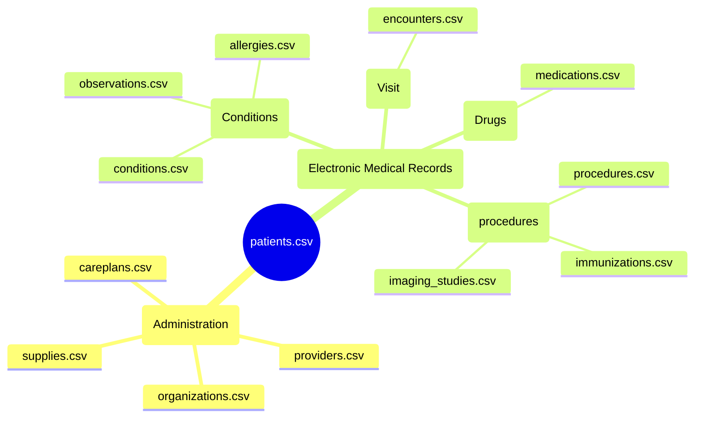

# ¿Qué es Synthea?

Synthea es un generador de datos sintéticos de pacientes que simula registros médicos realistas. Es útil para entrenamiento de modelos de machine learning en el campo de la salud.

> Datos actualizados al 2024-10-28T02:16:15.378831 con la version 1
