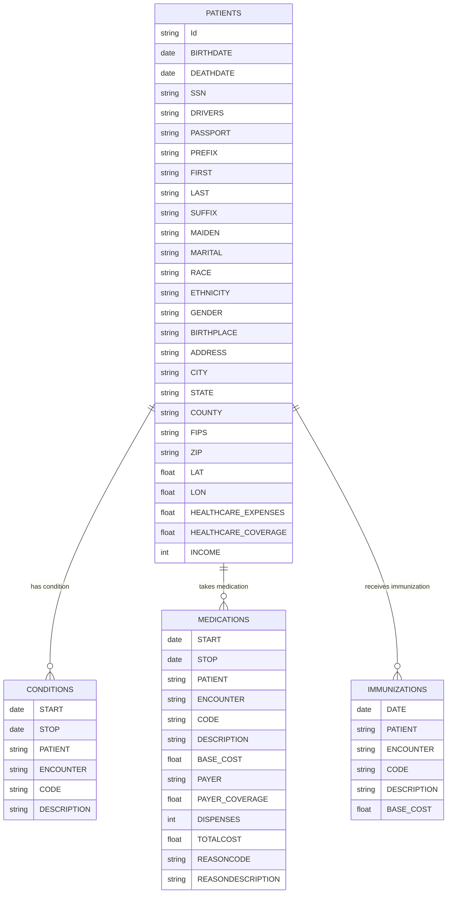

# 🟣 Synthea Tables

| Tables         | Descriptions                                        |
|---------------|----------------------------------------------------|
| Patients     | Contains demographic and basic medical information.|
| Medications  | Records of prescribed medications.                 |
| Conditions   | Diseases and documented clinical conditions.       |

----

# Example person table
## Person Table
{{table.person}}